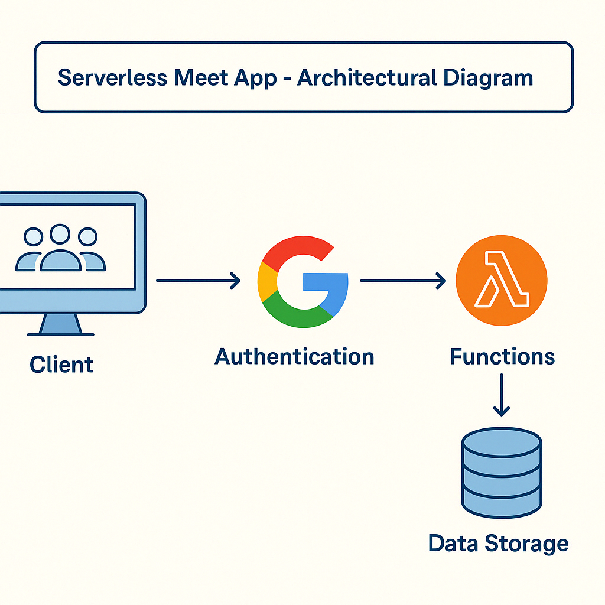

# Meet App

**Meet** is a serverless Progressive Web App (PWA) built with React and Vite, developed using Test-Driven Development (TDD). It fetches upcoming events via the Google Calendar API, supports offline usage, and is deployed on Vercel.

---

## User Stories

### Feature 1: Filter Events by City
As a user,  
I should be able to filter events by city,  
so that I can see only the events taking place in my chosen location.

### Feature 2: Show/Hide Event Details
As a user,  
I should be able to expand or collapse details for an event,  
so that I can view more information only when I need it.

### Feature 3: Specify Number of Events
As a user,  
I should be able to set how many upcoming events are displayed,  
so that I can focus on the number of events I want to see.

### Feature 4: Use the App When Offline
As a user,  
I should be able to view events even without an internet connection,  
so that I can plan when I have no or spotty network access.

### Feature 5: Add App Shortcut to Home Screen
As a user,  
I should be able to install the Meet app on my device’s home screen,  
so that I can launch it like a native app without entering a URL.

### Feature 6: Display Charts Visualizing Event Details
As a user,  
I should be able to see visual charts of event data (e.g., events per city or genre),  
so that I can quickly understand trends and distributions.

---

## Scenarios (Gherkin)

### Feature 1: Filter Events by City
```gherkin
Scenario: Show all upcoming events when no city is selected
  Given the user hasn’t searched for any city
  When the user opens the app
  Then the user should see a list of upcoming events from all cities

Scenario: Show city suggestions while typing
  Given the main page is open
  When the user starts typing in the city textbox
  Then the user should receive a list of city suggestions that match the input

Scenario: Select a city from suggestions
  Given the user typed "Berlin" and suggestions are visible
  When the user selects "Berlin, Germany" from the list
  Then the app should filter events to only those in "Berlin, Germany"
```  

### Feature 2: Show/Hide Event Details
```gherkin
Scenario: Details are collapsed by default
  Given the app has loaded
  When the user views the event list
  Then each event’s details should be collapsed

Scenario: User expands event details
  Given an event’s details are collapsed
  When the user clicks "Show Details"
  Then the event’s details should expand and be visible

Scenario: User collapses event details
  Given an event’s details are expanded
  When the user clicks "Hide Details"
  Then the event’s details should collapse and hide
```  

### Feature 3: Specify Number of Events
```gherkin
Scenario: Default number of events is shown
  Given the user has not specified an event count
  When the app loads
  Then 32 upcoming events should be displayed by default

Scenario: User specifies a valid number of events
  Given the full list of events is displayed
  When the user enters "10" into the number-of-events textbox
  Then only 10 events should be displayed

Scenario: User enters an invalid number
  Given the full list of events is displayed
  When the user enters "0" or a non-numeric value into the textbox
  Then the app should reset and display the default number of events (32)
```  

### Feature 4: Use the App When Offline
```gherkin
Scenario: Cache events after first load
  Given the user is online and opens the app
  When the app fetches events
  Then the events should be cached locally

Scenario: Display cached events when offline
  Given the user has previously loaded events
    And the user is offline
  When the user opens or refreshes the app
  Then the app should display the cached events

Scenario: Show offline indicator
  Given the user is offline
  When the app loads
  Then the UI should show an "Offline Mode" banner

Scenario: Handle no cache when offline
  Given the user is offline and has never opened the app
  When the user opens the app
  Then the app should display a message: "No connection—please go online once to load events."
```  

### Feature 5: Add App Shortcut to Home Screen
```gherkin
Scenario: Prompt to install PWA
  Given the user is on a supported browser/device
    And the app meets PWA install criteria
  When the app loads
  Then the browser should prompt the user to add the app to their home screen
```  

### Feature 6: Display Charts Visualizing Event Details
```gherkin
Scenario: Show scatterplot of events per city
  Given the app has event data
  When the user views the data visualization section
  Then a scatterplot showing the number of events in each city should render

Scenario: Show pie chart of event genres
  Given the app has event data
  When the user views the data visualization section
  Then a pie chart visualizing event genre popularity should render
```  

---

## Next Steps
1. Implement these features using TDD: write tests first, watch them fail, code until they pass, then refactor.  
2. Commit and push to GitHub.  
3. Deploy updates via Vercel.  
4. Begin setting up AWS for next Exercise on serverless functions.

## 🧭 Meet App Architecture (Serverless)

The following diagram illustrates the architecture of the Meet App using serverless functions, OAuth, and external APIs:



